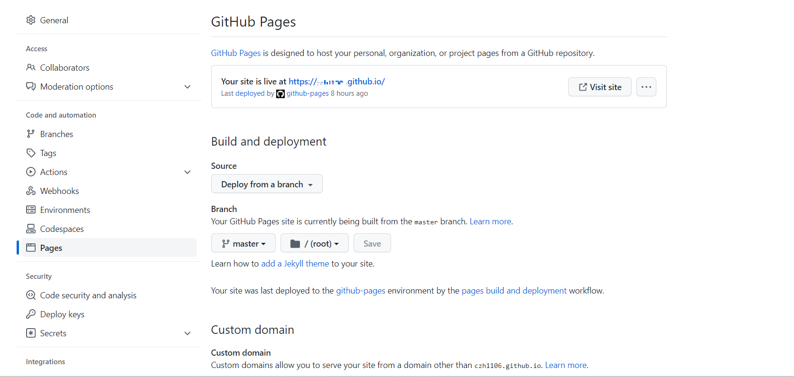

其实我萌生搭建自己的博客这个念头已经很久了，最初是在2018年的时候就有了，那会儿看了一个hexo搭建博客的例子就开始弄自己的blog,不过仅仅只是浅浅的照猫画虎了一番，是在自己的GitHub上搭建了一个demo，仅此而已，然后就是到了现在，才又把这个重新捡了起来(在此为我之前的半途而废而感惭愧:joy:)

咳咳，往事翻篇，现在我要认真的重新搞起我的blog啦！从零开始~

其实个人搭建博客的技术选型我在WordPress和Hexo之间有过徘徊，下面简单汇总了这两种方式搭建博客各自的特点。

#### WordPress

WordPress(简称WP)是用PHP语言开发的一款免费开源的博客平台，目前是全球最流行的博客系统了，世界上约有43% 的网站都在使用WordPress，小到兴趣博客，大到新闻网站。so它也可以是一个CMS作为你的内容站。

特性：
- 功能强大、扩展性强插件众多
- 对SEO搜索引擎友好，收录快，排名靠前
- 主题众多
- 写东西方便，任意一台电脑、手机即可

具体的搭建步骤如下：
- 注册自己的WordPress账号
- 注册域名(国内有[阿里云(万网)](https://wanwang.aliyun.com/domain)、[新网](https://www.xinnet.com/)、[聚名网](https://www.juming.com/)、[江苏邦宁(中数)](https://www.com.top/)、[Namesilo](https://www.namesilo.com/?rid=d27fa32do)等)
- 创建VPS(需要购买)
- 域名解析
- 连接VPS
- 搭建WordPress
- 主题、插件等配置

#### Hexo
Hexo是基于node.js git搭建的，所以需要有一定的极客属性，可以直接在GitHub pages平台上托管。

特性：
- 快速、简洁
- 支持MarkDown，后期也好迁移
- DIY每个人都可以定义自己的blog

步骤：
- 本地搭建环境:
    - 安装并配置node.js>[Win](https://zhuanlan.zhihu.com/p/506609305)
    - 安装git>[Win](https://cloud.tencent.com/developer/article/2134190)
    `Mac上推荐使用HomeBrew来安装管理`

- 注册GitHub账号，并创建自己的`xxx.github.io`
    - 创建仓库，并命名为`xxx.github.io` 
    
    - 设置pages，按提示操作即可
    
- hexo操作
    - 安装hexo, **npm install -g hexo** `如果是国内的话可以设置npm镜像源为https://npmmirror.com/`
    - hexo初始化文章
    - hexo 绑定GitHub
    ``` txt
    在_config.xml下设置deploy为GitHub，repo为你自己的仓库地址
    ```
    

但是综合考虑(主要是成本)之后选择了Hexo,毕竟身为一个技(穷)术宅(人)，还是选择免费的Hexo可玩儿性比较高，哈哈。


